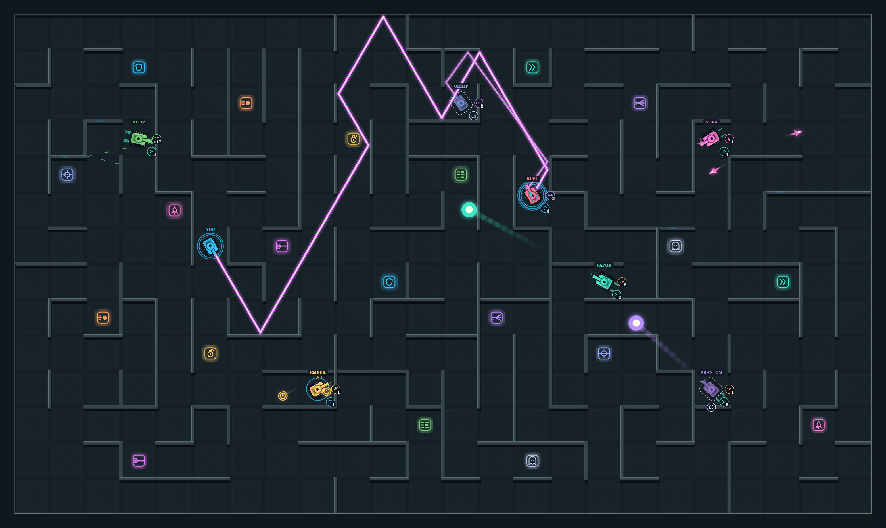

# leqra

https://leqra.com

An online multiplayer tank arena battle game.

Generated 100% by ChatGPT Astra.



- 4 fun free-for-all and team based game modes:
    1. Elimination
    2. Capture the flag
    3. King of the hill
    4. Survival
- 10 collectable power-ups:
    1. Cannon
    2. Ghost
    3. Laser
    4. Homing missile
    5. Grenade
    6. Scope
    7. Super speed
    8. Machine gun
    9. Shotgun
    10. Shield
- Flexible lobby rooms supporting:
    1. Local players
    2. Bots
    3. Online players
    4. Teams
    5. Spectators
    6. Online matchmaking
- 4 bot levels:
    1. Chill
    2. Normal
    3. Fierce
    4. Godlike
- 6 map sizes.
- 8 tanks at a time.
- A second local player.
- Mobile & PWA support.
- Managed deployments to minimize downtime.

## Getting Started

You can open [index.html](./src/web/index.html) to play locally.

To run from the server:

```sh
go build  -o ./bin/leqra ./src && ./bin/leqra
```

You can deploy the binary anywhere as all assets are embedded.

## TODO

1. Increase version for the safari detection message change.
1. The src/web/assets that duplicate from src should be symlinks instead of having entirely duplicate versions.
2. Add mouse pointer aiming + click to fire to the controls for player 1 on desktop.
3. Simplify the initial UI to just a big PLAY button and then add an advanced button that reveals the current lobby UI to allow making changes. Or maybe there should be more intermediate buttons like another button to show the full roster?
4. Maybe add health bars to let tanks have 3 shots?
5. Add a intro mode to explain the controls & mechanics.
6. On Mobile, mazes should be larger vertically than horizontally to use screen real estate effectively.
7. Maybe tanks should be protected against all of their own projectiles?